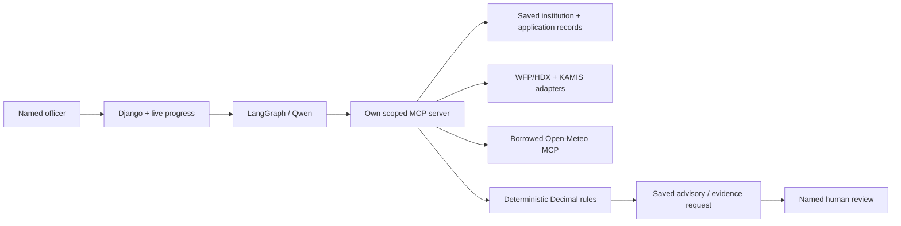

# FarmCredit architecture

**Shape:** a Python modular monolith for the proposed Uzima Havillah agricultural-advisory workflow. Django templates/HTMX present an officer-owned synthetic application; LangGraph coordinates the open-weights `qwen/qwen3-235b-a22b-2507` model through OpenRouter. PostgreSQL stores immutable inputs, evidence, drafts and named reviews. Hosting inference does not establish in-country processing.

**Built MCP:** `get_case` reads the bound application and gaps; `get_records` retrieves selected records; `assess_cashflow` checks supplied policy and dated repayments; `save_draft` writes a sourced advisory or questions-only evidence request. A short-lived signed stdio credential binds officer and run outside model arguments. There is no approval, farmer-message, loan-origination or disbursement tool.

**Borrowed MCP:** Apache-2.0 `open-meteo-mcp==0.2.0`, installed unchanged in a separate uv-locked MCP v1 runtime. It supplies tested city/date-range forecast discovery and retrieval instead of another bespoke weather transport. Our adapter validates geography, hourly coverage and the JSON envelope; embedded provider instructions have no authority. WFP/HDX and KAMIS use bounded direct adapters. All sources retain identity, retrieval time and limitations; weather never supplies an invented yield adjustment and market quotes never overwrite sale assumptions.

**Boundaries:** `domain/` owns Decimal arithmetic and evidence/policy rules, independently of Django or providers. `application/` defines intake, assessment and draft contracts. `adapters/` owns storage, authorised access and external integrations. `interfaces/` exposes the web and MCP. Unknown values remain unknown; model narrative is separate from authoritative calculations.

**Persistence and control:** PostgreSQL transactions and immutable-record triggers protect application versions, evidence, calculations, drafts and decisions. Calls are recorded before execution; missing outcomes remain unknown. A newer input, policy or draft invalidates review eligibility. Named officer approval applies to the exact advisory, not credit. The lender retains the credit decision; intended-user role validation remains pending.

## Execution and failure handling

One bounded foreground POST runs the agent; independent read-only progress requests show actual tool/model status and elapsed time. Limits are 120 seconds, 12 tools, 10 model requests, one transient retry, 35 seconds/3,000 output tokens per model request and 128 KiB context. The 60,000 reported-token threshold is checked before another model request, so the final response can overshoot it; it is not a hard billing cap. The UI reports interrupted updates separately from task completion. There is no durable background worker, request queue or automatic process recovery. Evidence is frozen per run; follow-ups start new investigations, not cached model responses.

The web layer renders a shared finding and review status. Model completion, named
advisory review and the lender's decision are distinct. Signed start tokens bind the
application, officer and run; progress GETs cannot execute work. Polling preserves
the foreground error target and keyboard disclosure state. UI wording helpers never
rewrite stored provenance or calculation inputs.

## MCP transport

The trusted launcher issues a 120-second signed credential binding the authenticated
officer and run. It starts `farmcredit-mcp` over stdio with `FARMCREDIT_MCP_TOKEN`,
the shared signing secret and PostgreSQL settings. These credentials are not model
arguments. Each tool call rechecks access and requires a UUID operation ID; identical
retries reuse the outcome. Saving a draft ends the run. The fixed comparison uses
the same dispatcher directly; the agent uses the MCP client/server connection.
This is a local trusted transport, not a public HTTP MCP service.

## Verification and limits

**Verification:** Software tests check arithmetic, access, immutable PostgreSQL records, failure handling and actual MCP subprocess exchanges using controlled model responses. Browser checks cover the case-to-review journey, failure recovery, keyboard access and narrow layouts. Hosted-model checks are separate, explicitly budgeted operations; their success does not establish general reliability. [Workflow](docs/workflow.md) owns scope and remaining limits; [README](README.md) owns setup. Production lender integrations, institution-wide sharing and validated agricultural decision models are outside this prototype.
