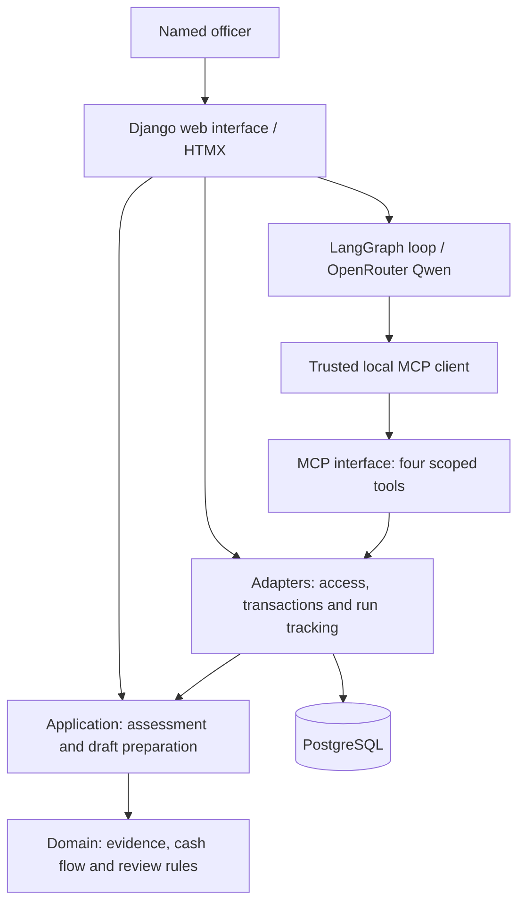

# FarmCredit architecture

FarmCredit helps an institution's officer turn sourced farmer records into a
reviewable agricultural cash-flow advisory. The lender retains the credit decision.

## Design

A **modular monolith**: one Python codebase, Django templates with HTMX, and
PostgreSQL in development, tests and deployment. A separate local stdio process
exposes MCP tools using the same application code and database.

Clean Architecture's dependency rule keeps financial rules independent of Django,
storage and agent tooling. Small functions and typed data provide the boundaries;
separate services are unnecessary for the current scope.

Arrows show calls and storage access. The domain and application layers never
import the outer layers. Interfaces wire concrete adapters; adapters own
database transactions and coordinate persistent operations.

| Code location | Responsibility |
| --- | --- |
| `src/farmcredit/domain/` | Decimal arithmetic, dated repayments, evidence validation and human-review rules. |
| `src/farmcredit/application/` | Incomplete intake snapshots, case and record contracts, assessment, stress scenarios and draft validation. |
| `src/farmcredit/adapters/` | Synthetic records, authorised case access, persistence and bounded tool execution. |
| `src/farmcredit/interfaces/` | Authenticated web workflow and local MCP protocol boundary. |

## Current data and decision flow

1. A named officer saves a synthetic application, including incomplete values and source details. Each immutable version belongs to that officer; competing edits cannot overwrite it.
2. A trusted caller starts a run bound to that application version and officer, capturing its explicitly linked synthetic institution file, the demo review policy in immutable `scope_json`. The fixed check also captures external snapshots there; model runs freeze selected external sources on demand in immutable `RunEvidence` rows. MCP exposes `get_case`, `get_records`, `assess_cashflow` and `save_draft`. Historical assessment-bound runs remain supported.
3. The agent action uses LangGraph to alternate model selections and actual MCP results, with bounded calls and one transient model retry. The separate fixed evidence check uses a fixed sequence of those tools. It retrieves saved intake and frozen institution/market/weather records, checks the supplied review rules, calculates when supported and saves an advisory or evidence request. Questions-only requests can finish without a calculation call when the server verifies intake gaps or unresolved institutional checks. Actual retrieved results stay in immutable tool-call records, not in a rewritten application.
4. A named officer reviews the exact draft. The draft includes authoritative calculation output, or a not-calculated finding and evidence gaps. Saving a new application version makes prior reviews historical and prevents stale approval. Existing saved assessments remain readable.

Market retrieval lives in `adapters/market_hdx.py` and `adapters/market_kamis.py`: a fixed public CSV URL, explicit
Nakuru maize/wholesale selection, bounded response and timeout. The immutable run
evidence freezes successful or unavailable retrieval; tools never refresh it mid-run.
`application/market_evidence.py` verifies snapshot identity and restores provenance;
`domain/market.py` handles freshness and unit comparison without I/O. Calculation
identity includes the market fingerprint, but external prices never overwrite sale
assumptions. Drafts expose attribution, source month, findings and requested evidence.
No database migration or additional dependency is required for market evidence.

`adapters/weather_mcp.py` calls the unchanged external `open-meteo-mcp` 0.2.0
server over stdio in a separate uv-locked environment. Only its date-range weather
tool is called, with a fixed city reference and bounded dates. The JSON data is
extracted from its prose envelope; provider instructions have no authority.
`application/weather_evidence.py` restores the immutable snapshot and
`domain/weather.py` validates geography, hourly coverage, nulls and season limits.
Fixed run creation retrieves selected sources before freezing scope. Model runs retrieve
only requested external categories, then freeze them in per-run rows.
No weather result changes deterministic cash-flow inputs or policy.

## Model investigation

Saved application → agent investigates institution, market and weather evidence →
deterministic assessment → sourced draft → named human review.

Application binding, synthetic institution records, WFP/KAMIS market evidence and external-MCP weather forecasts are implemented.
Calculations reference the exact frozen evidence while keeping supplied financial and harvest assumptions. LangGraph coordinates the open-weights Qwen3-235B-A22B-Instruct-2507 model through
OpenRouter and our MCP tools. Weather uses the borrowed Open-Meteo MCP server.
Immutable `InvestigationEvent` rows record requests and outcomes; absent outcomes
remain unknown. Provider secrets and private reasoning are not stored. Actual synthetic acceptance covers a full sourced task, missing records with an injected
connection failure, and conflicting terms. Broader repeated/held-out evaluation remains. External adapters
keep provider-specific code outside the domain. Implement in the order and against
the completion checks in [workflow.md](workflow.md#agreed-delivery-map).

## Enforced safeguards

- **Evidence:** a run retains the exact institutional file, policy version and fingerprint it used; unknown values remain unknown; observations, assumptions and synthetic records retain their labels. Citation membership does not prove a narrative claim is true.
- **Access:** web authentication and CSRF protection; MCP credentials bind identity and case outside tool arguments. Tools cannot approve credit or drafts.
- **Persistence:** one PostgreSQL database holds accounts, sessions, application versions, assessments, drafts, reviews and runs. Transactions and per-case locks coordinate writes; database triggers protect saved versions and final audit outcomes.
- **Policy:** three explicitly illustrative review rules request history, flag arrears and reconcile obligations. Decimal arithmetic determines recorded arrears. Savings do not enter cash automatically; historical yields do not replace assumptions. Policy changes block stale runs and draft approvals. These checks do not approve credit.
- **Execution:** 12-call and 120-second run limits, exact-retry reuse and explicit failure states. Advisory drafts must reference a calculation performed in their run; incomplete requests require server-verified intake or institutional gaps.

## Verification and current limits

Tests cover domain calculations, PostgreSQL persistence, permissions, stale reviews,
retries and real MCP subprocess exchanges. CI runs lint, formatting, Django checks,
tests and packaging on Python 3.10 and 3.14.

The implementation supports varied officer-owned synthetic applications and retains
the original single-case calculator. The application UI exposes the fixed check
and agent actions with actual run traces and three prefilled synthetic household examples.
Institution-level access sharing and production deployment remain pending. No real-world agent performance or institutional fit is claimed.

See [workflow.md](workflow.md) for product decisions and [README.md](../README.md)
for setup and verification commands.
