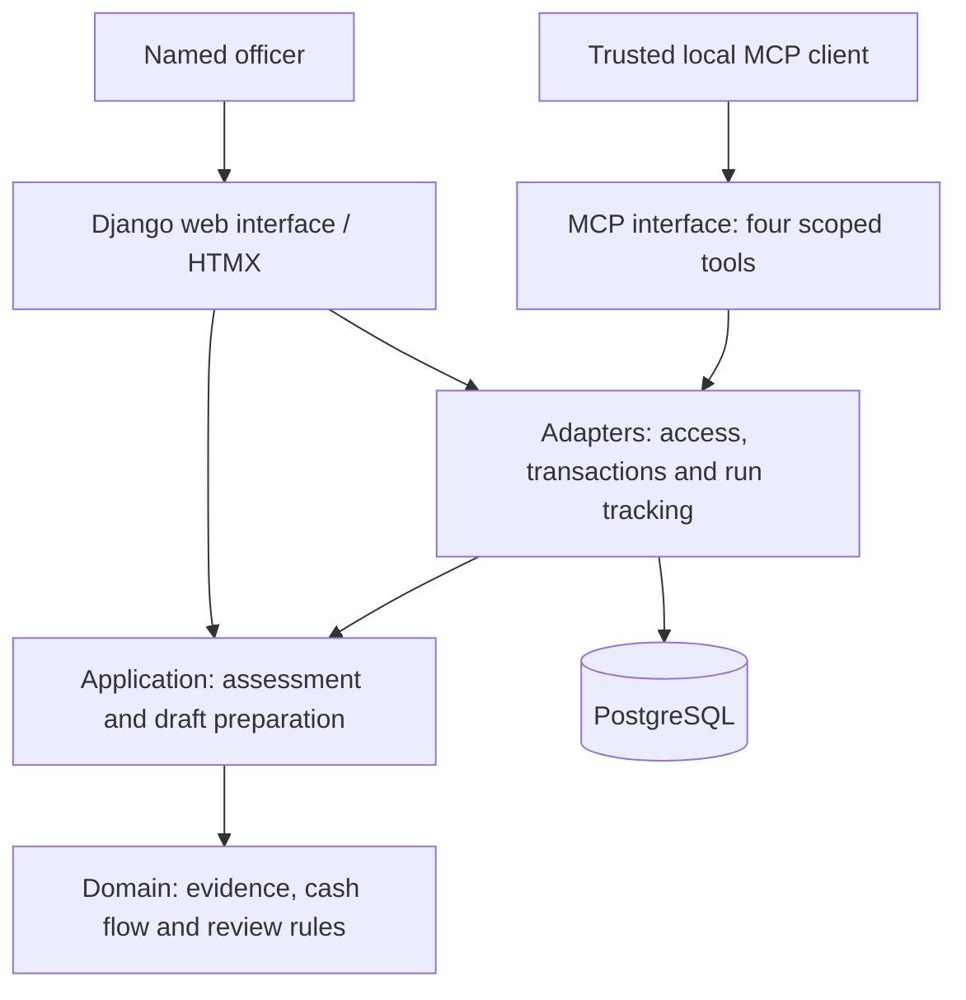

# FarmCredit architecture

FarmCredit helps an institution's officer turn sourced farmer records into a
reviewable agricultural cash-flow advisory. The lender retains the credit decision.

## Design

A **modular monolith**: one Python codebase, Django templates with HTMX, and
PostgreSQL in development, tests and deployment. A separate local stdio process
exposes MCP tools using the same application code and database.

Clean Architecture's dependency rule keeps financial rules independent of Django,
storage and agent tooling. Small functions and typed data provide the boundaries;
separate services are unnecessary for the current scope.

Arrows show calls and storage access. The domain and application layers never
import the outer layers. Interfaces wire concrete adapters; adapters own
database transactions and coordinate persistent operations.

| Code location | Responsibility |
| --- | --- |
| `src/farmcredit/domain/` | Decimal arithmetic, dated repayments, evidence validation and human-review rules. |
| `src/farmcredit/application/` | Case and record contracts, assessment, stress scenarios and draft validation. |
| `src/farmcredit/adapters/` | Synthetic records, authorised case access, persistence and bounded tool execution. |
| `src/farmcredit/interfaces/` | Authenticated web workflow and local MCP protocol boundary. |

## Data and decision flow

1. An officer signs in, reviews sourced inputs, calculates and saves an immutable assessment version.
2. A trusted caller starts a run bound to that officer and saved version. MCP exposes `get_case`, `get_records`, `assess_cashflow` and `save_draft`.
3. Tools recompute figures deterministically and save a cited draft, or a request for missing evidence. The run records actual calls and outcomes.
4. A named officer reviews the exact draft in the web interface. Server-side checks reject stale approvals; previous versions remain historical.

## Enforced safeguards

- **Evidence:** unknown values remain unknown; observations, assumptions and synthetic records retain their labels. Citation membership does not prove a narrative claim is true.
- **Access:** web authentication and CSRF protection; MCP credentials bind identity and case outside tool arguments. Tools cannot approve credit or drafts.
- **Persistence:** one PostgreSQL database holds accounts, sessions, assessments, drafts, reviews and runs. Transactions and per-case locks coordinate writes; database triggers protect saved versions and final audit outcomes.
- **Execution:** 12-call and 120-second run limits, exact-retry reuse and explicit failure states. Drafts must reference a calculation performed in their run.

## Verification and current limits

Tests cover domain calculations, PostgreSQL persistence, permissions, stale reviews,
retries and real MCP subprocess exchanges. CI runs lint, formatting, Django checks,
tests and packaging on Python 3.10 and 3.14.

The implementation remains a single synthetic case. Model orchestration, external
evidence, institution-level access separation, run UI and production deployment
are pending. No real-world agent performance or institutional fit is claimed.

See [workflow.md](workflow.md) for product decisions and [README.md](../README.md)
for setup and verification commands.
